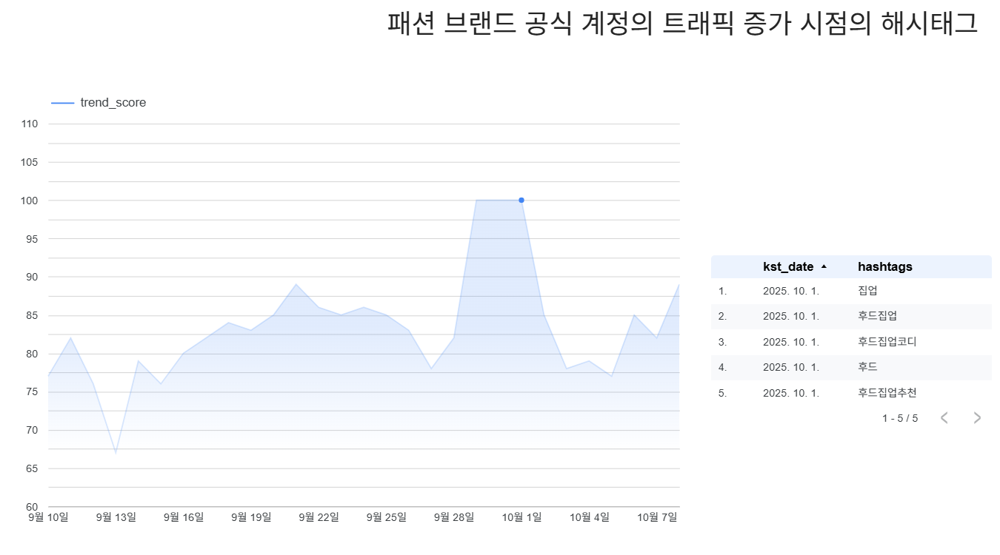
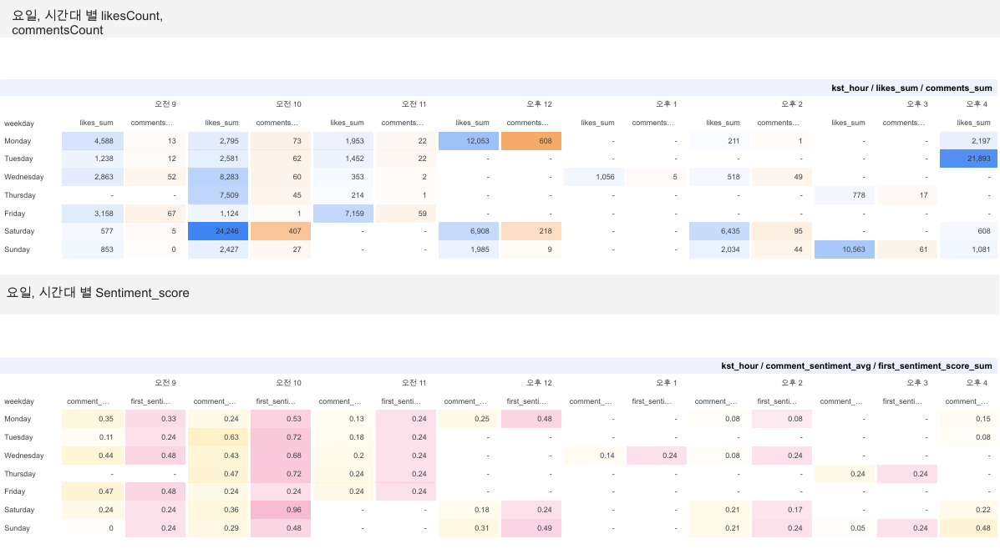

data source= sentiment_and_etl로 처리한 데이터 (df_info.txt)
1. 분석 (빅쿼리 sql)

# 콘텐츠 반응 패턴 분석

[1]. 트렌드 추세선과 해시태그(가중치 먹인거)
-> "트렌드 상승시에 어떤 해시태그가 노출이 되는가"

[2]. 시간대에 따른 게시글 참여도, 감정 차이
-> "언제 올려야 반응이 좋은가"

[3]. 시간에 따른 감정 변화 (히트맵) - 내용이나 해시태그 내용도 표현
->"호감/반감형 콘텐츠 탐지"

sentiment_diff = comment_sentiment_avg - first_sentiment_score
> 0: 시간이 갈수록 긍정적 반응 증가 (호감 확산형) -> 노랑
< 0: 시간이 갈수록 부정 반응 증가 (반감 확산형) -> 파랑
= 0: 반응이 일관됨 -> 회색

[4]. 게시글과 댓글 감정 일치도 (산점도) - 내용이나 해시태그 내용도 표현
->"감정 전달력/ 공감도 분석"

sentiment_alignment = 1 - ABS(sentiment_score - comment_sentiment_avg)
1에 가까울수록 일치 (대각선 1)
x(게시글),y(댓글)

  
  &nbsp;&nbsp;
  

# 추천 우선순위 개선을 위한 피처 가중 분석

외부 플랫폼(인스타그램, 구글 트렌드)에서
특정 브랜드에 대한 해시태그 반응·감성 패턴을 추적한 뒤,
이를 동일 브랜드 상품의 추천 우선순위 조정에 반영 →
“지금 시장에서 뜨는 브랜드 상품을 먼저 보여줄 수 있음”

해시태그 반응·감성 점수
score =
      + a * sentiment_avg
      + b * trend_norm
      + c * normalized_engagement

[1]

=========================
#0~1 norm
--engagement = commentsCount + likesCount
normalized_engagement = SAFE_DIVIDE(engagement,MAX(engagement) OVER())
--sentiment_avg = (caption_sentiment + avg_comment_sentiment) / 2
sentiment_norm = SAFE_DIVIDE(sentiment_avg + 1, 2)
trend_norm = SAFE_DIVIDE(
                trend_value - MIN(trend_value) OVER (),
                NULLIF(MAX(trend_value) OVER () - MIN(trend_value) OVER (), 0)
              )

#이거 비율은 corr 해볼거임
score =
      + a * sentiment_avg
      + b * trend_norm
      + c * normalized_engagement

==========================
필요패키지 설치
pip install -r requirements.txt

필요 추가 전처리 테이블 빅쿼리 업로드 

(날짜별 게시글 하나[가중치 두고 계산한 engagement score 기준], 가중치로 중요 해시태그 정제)

preprocessing\preprocessing_hashtag_date_update.ipynb
