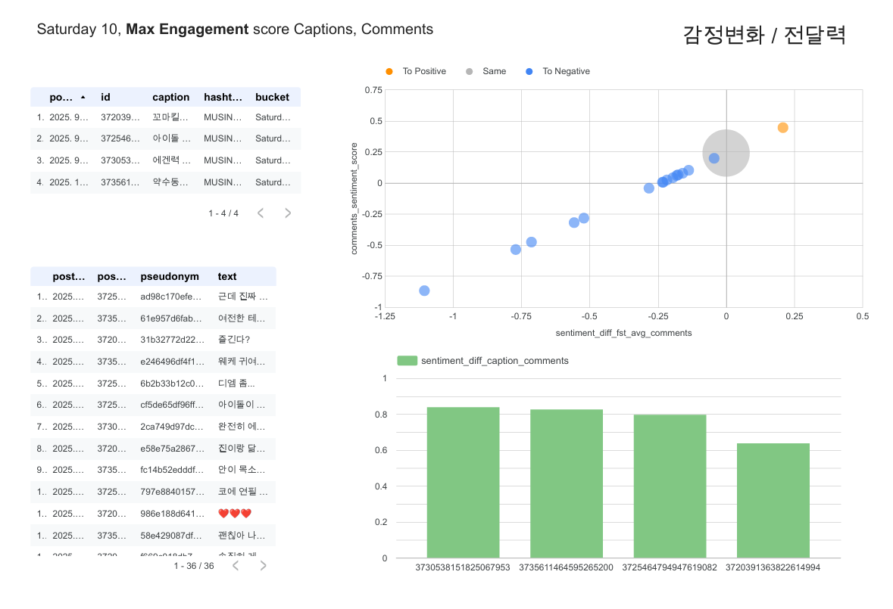
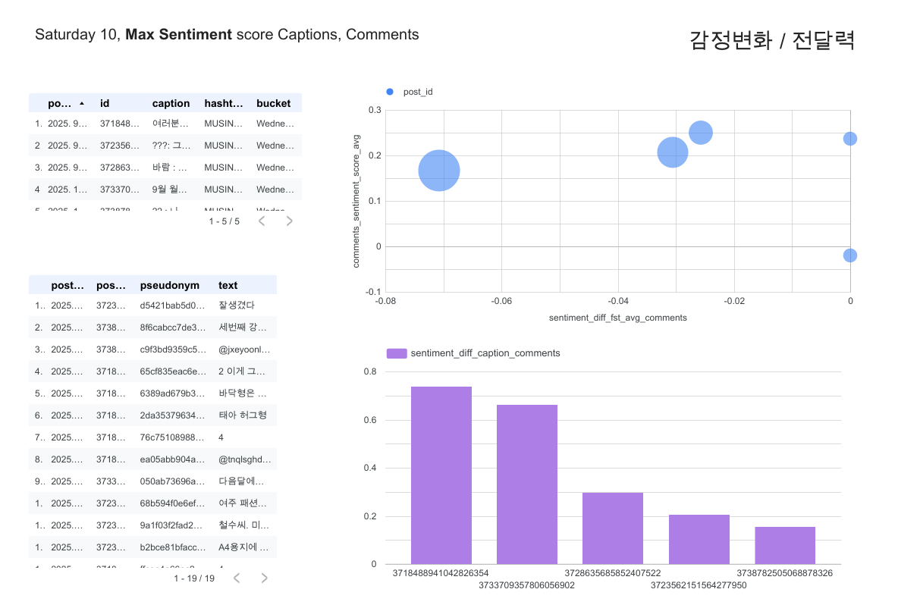

data source= sentiment_and_etl로 처리한 데이터 (df_info.txt)
1. 분석 (빅쿼리 sql)

# 콘텐츠 반응 패턴 분석

[1]. 트렌드 추세선과 해시태그(가중치)
-> "트렌드 상승시에 어떤 해시태그가 노출이 되는가"

[2]. 시간대에 따른 게시글 참여도, 감정 차이
-> "언제 올려야 반응이 좋은가"

[3]. 게시글과 댓글 감정 일치도 (산점도) - 내용이나 해시태그 내용도 표현
-> "최대 반응 시간대의 사용자 감정 변화와 콘텐츠 전달력"

### 트렌드 변화

### 시간대 반응

### 유저 감정변화, 내용 전달력 (max engagement, max sentiment)

# 분석결과

### 1. 구글 트랜드 & 공식 SNS 해시태그 분석

  **"브랜드 분석 : 트렌드 상승시에 어떤 해시태그가 노출이 되는가”**

- 공감형(직장인 밈) 콘텐츠가 트래픽 상승 견인  

- 상업성 노출이 강화되면 반응 둔화 → ‘참여–이탈 주기’ 확인  

- 시즌성 키워드(카디건, 가을 니트, 팬츠)는 안정적 검색 유지

[Looker Studio 대시보드 보기](https://lookerstudio.google.com/reporting/7944035d-6368-4047-a874-cbc765b408d3)

### 2. 시간대 별 공식 SNS 반응 분석

 **"사용자 분석 : 언제, 무엇을 올려야 사용자 반응이 좋은가”**

- 좋아요 집중: 오전 10시, 오후 12시, 4시, 6–7시  

- 댓글 집중: 오전 10시, 오후 12시, 4시, 6시  

- 오전 9–10시, 오후 6–7시 → 정기 업로드에 적합한 안정 구간

[시간대별 피봇 보기](https://lookerstudio.google.com/reporting/03d2a02b-fd83-4689-85ed-847f9863862b)

**"사용자 분석 : 최대 반응 시간대의 사용자 감정 변화와 콘텐츠 전달력”**

- 감정 변화 폭이 큰 콘텐츠 → 질문 유도형·참여형 콘텐츠 (‘수면 유형’)  

- 감정 변화 폭이 작은 콘텐츠 → 안정형 일상 콘텐츠 (‘댕냥이’) 

- 감정 변화 없음 → 상품성 콘텐츠 (‘바람막이’)

→ 감정 차이 큰 콘텐츠는 실시간 참여 유도, 안정형 콘텐츠는 브랜드 신뢰 유지에 효과적

[감정 변화 분석 보기](https://lookerstudio.google.com/reporting/5c15fb1c-d06c-4f3e-aa3d-b2caf4680cc5)

# 비즈니스적 인사이트

- **참여형 콘텐츠** → 실시간 반응·트래픽 확보 (Real-time Engagement)

- **안정형 콘텐츠** → 브랜드 신뢰·지속 노출 유지 (Long-term Retention)

- **추천 시스템 응용:**  
  트래픽 상승 구간의 해시태그를 기반으로  

  - 공감형(해시태그A)  

  - 참여형(해시태그B)  

  - 상품형(해시태그C)  

  으로 분류해 **시간대별·감정 기반 추천 모델**로도 확장 가능

  
=========================
#0~1 norm
--engagement = commentsCount + likesCount
normalized_engagement = SAFE_DIVIDE(engagement,MAX(engagement) OVER())
--sentiment_avg = (caption_sentiment + avg_comment_sentiment) / 2
sentiment_norm = SAFE_DIVIDE(sentiment_avg + 1, 2)
trend_norm = SAFE_DIVIDE(
                trend_value - MIN(trend_value) OVER (),
                NULLIF(MAX(trend_value) OVER () - MIN(trend_value) OVER (), 0)
              )

#이거 비율은 corr 해볼거임
score =
      + a * sentiment_avg
      + b * trend_norm
      + c * normalized_engagement

==========================
필요패키지 설치
pip install -r requirements.txt

필요 추가 전처리 테이블 빅쿼리 업로드 

(날짜별 게시글 하나[가중치 두고 계산한 engagement score 기준], 가중치로 중요 해시태그 정제)

preprocessing\preprocessing_hashtag_date_update.ipynb
